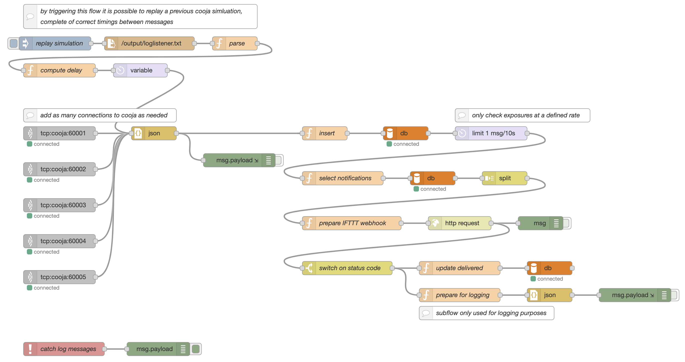

# Keep Your Distance

## Introduction

To import the Node-RED flow and at least visualise it correctly, the following packet
must be installed: `node-red-node-mysql`. If the package is not installed all nodes related
to the database functionality won't render, but the flow will still be readable as said
nodes contain no specific configuration (they just execute the query they are fed). If
one wants to test the system, an automatic way of deploying Node-RED, the database and Cooja is provided
with Docker (or just Node-RED and the database). An image of the flow is provided inside ``img/`` as reference.



## Folder structure

`tinyos/` contains all TinyOS related files to build the firmware.

`mysql/` contains the script that is run when the database is created, so the table definitions and the 
triggers can all be found there.

`node-red/` contains the flow implementation inside the file `flows.json`.

``simulation/`` contains the log output of the simulation run in Cooja, as well as an export of the
database tables at the end of the simulation itself. 

## Docker

### Configuration

Configuration is done via an `.env` file that has to be placed in the same directory as the `docker-compose.yaml` file.

| Variable | Description |
|----------|-------------|
| `IFTTT_KEY` | The IFTTT API key |
| `HOSTNAME` | The hostname of the machine were XQuartz is running, only needed if running Cooja on XQuartz |
| `MYSQL_ROOT_PASSWORD` | The password for the user `root` of the MySQL database |
| `MYSQL_USER` | The username of the user used to access the MySQL database (used by Node-RED) |
| `MYSQL_ROOT_PASSWORD` | The password of the user used to access the MySQL database (used by Node-RED)  |

Example of `.env` file:

```
IFTTT_KEY=cdUy687b87BBybsbsu7ndOpXNEO7
HOSTNAME=localhost
MYSQL_ROOT_PASSWORD=root
MYSQL_USER=user
MYSQL_PASSWORD=password
```

### Running

To have Node-RED running and the database automatically created, simply run:

```
docker compose up node-red
```

or, if using the older docker command:

```
docker-compose up node-red
```

### Cooja via XQuartz

To also start Cooja with the docker compose setup, XQuartz is required. In order to have Cooja connect
to XQuartz an environment variable containing the hostname of the client machine has to be created. To
allow the client to connect to XQuart run:

```
xhost + ${HOSTNAME}
```

and then the whole Docker setup can be run with a single command:

```
docker compose up
```

or, if using the older docker command:

```
docker-compose up
```